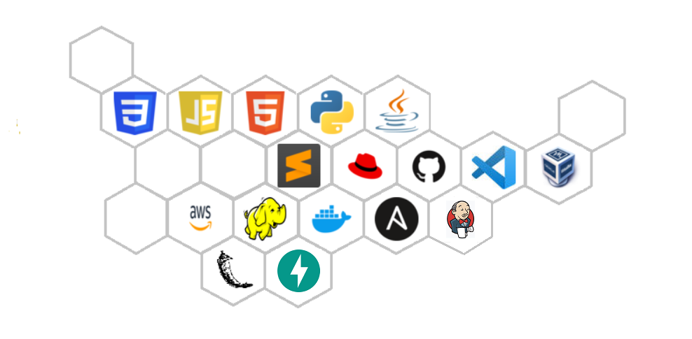

### Hello, I am Yash Indane
I always keep myself updated with the latest technologies used in the industry . My areas of interest are Cloud Computing, Programming, Machine Learning, Artificial Intelligence, DevOps, MlOps, Big Data etc. I contribute on Github as well as I have also contributed various roles on Ansible Galaxy and container images on Docker Hub.

- [Ansible Galaxy Profile](https://galaxy.ansible.com/my-content/namespaces)
- [Docker Hub Profile](https://hub.docker.com/repositories)
- [HackerRank Profile](https://www.hackerrank.com/yashindane46)

<!--
**YashIndane/YashIndane** is a ✨ _special_ ✨ repository because its `README.md` (this file) appears on your GitHub profile.-->

- 🔭 I’m currently working on a webapp for automation of hadoop , docker and AWS using voice commands
- 🌱 I’m currently learning new technologies
- 👯 I’m looking to collaborate on open source projects

- Languages , technologies and tools that I know ->

